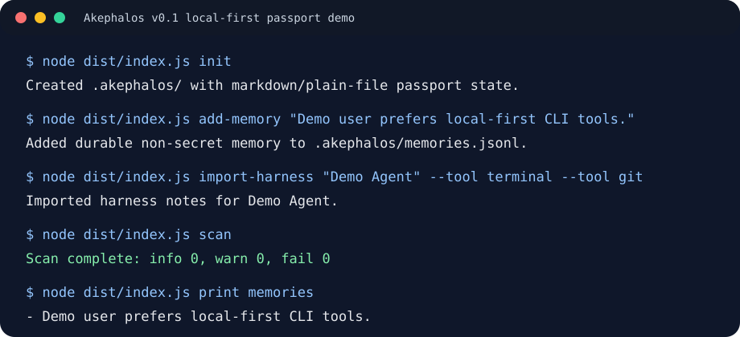

# Akephalos

Akephalos is a tiny open-source, markdown-first passport for AI agents.

It lets you carry your preferences, tools, rules, projects, harness notes, and durable memories across different AI agents and machines.

Instead of teaching Codex, Cursor, Claude Code, Hermes, Pi IDE, or another agent the same context again and again, you keep a local `.akephalos` bundle that each agent can read before starting work.

Because the bundle is plain Markdown + JSONL, it can be synced through your own private Git repo. Multiple agents on different systems can share the same durable context without a hosted memory service, dashboard, database, cloud account, vector search, OAuth, blockchain, or agent runtime.

## What It Is

- Markdown-first: humans can read and edit the core files.
- Local-first: the passport lives in a local `.akephalos` folder.
- Open-source: the package should be buildable and inspectable.
- Decentralized by default: no hosted account is required.
- Agent-friendly: agents can read stable identity, rules, tools, projects, and memories.
- MCP-compatible where useful: MCP is optional, not required.
- Git-friendly: private Git sync is optional and user-controlled.

## What It Is Not

- Not a hosted memory service.
- Not a dashboard.
- Not a vector database.
- Not a blockchain project.
- Not an OAuth/account system.
- Not a secret manager.
- Not a universal memory platform.

Do not store secrets in Akephalos memories.

## Quickstart

Akephalos is in early `v0.1` prerelease. If you want the shortest safe trial path, see [Try Akephalos in 5 Minutes](docs/TRY_IN_5_MINUTES.md). If you are deciding whether the MVP fits your use case, skim the [Adopter FAQ](docs/ADOPTER_FAQ.md) first. If you prefer to skim expected output first, see the fictional [demo transcript](examples/demo-transcript.md), the tiny [terminal demo SVG](examples/terminal-demo.svg), or the public-safe [starter passport example](examples/starter-passport/README.md). If you are testing MCP clients, start with [MCP Client Config Snippets](docs/MCP_CLIENT_SNIPPETS.md) and submit a conservative compatibility report.



The best way to try it today is from a source checkout:

```sh
git clone https://github.com/sunnja69/akephalos.git
cd akephalos
npm ci
npm run build
node dist/index.js --help
```

Create a local passport bundle:

```sh
node dist/index.js init
```

Inspect the bundle:

```sh
node dist/index.js status
node dist/index.js scan
node dist/index.js print identity
node dist/index.js print rules
node dist/index.js print projects
node dist/index.js print memories
```

Add a durable non-secret memory:

```sh
node dist/index.js add-memory "User prefers small dependency-light CLI changes."
```

Import a harness profile:

```sh
node dist/index.js import-harness "Pi IDE" --tool "terminal" --tool "git" --preference "Prefer small diffs"
```

Show a lightweight weekly digest:

```sh
node dist/index.js pulse
```

Compile memories into the readable identity document:

```sh
node dist/index.js compact
```

Create a portable snapshot:

```sh
node dist/index.js export
```

Start the MCP server:

```sh
node dist/index.js mcp
```

For client config snippets and a safe smoke-test checklist, see [Local MCP Setup Notes](docs/MCP_SETUP.md).

If you add the built CLI to your shell path later, the same commands are available as:

```sh
akephalos init
akephalos status
akephalos scan
akephalos add-memory "Durable non-secret context."
```

## Contributing

Akephalos is deliberately small, so the best contributions are practical field reports and tiny improvements that help another agent/user try the passport safely.

Good first places to help:

- Try the quickstart on Windows, macOS, Linux, or WSL and report what worked or broke. Windows testers can start with the unverified [PowerShell smoke-test recipe](docs/WINDOWS_POWERSHELL_SMOKE_TEST.md). If you are not sure what Akephalos can and cannot safely claim yet, read the [Adopter FAQ](docs/ADOPTER_FAQ.md) before filing a report.
- Test the `.akephalos` bundle with one agent harness such as Claude Code, Codex, Cursor, Hermes/OpenClaw, or another MCP client. For a conservative harness check, use the [Agent Harness Smoke Test](docs/AGENT_HARNESS_SMOKE_TEST.md).
- Improve examples, screenshots, terminal transcripts, starter passport files, or MCP setup notes using fictional/non-secret data only.
- Share a sanitized compatibility report using the GitHub issue template after trying the local CLI or MCP server.
- Use the [Compatibility Reports](docs/COMPATIBILITY_REPORTS.md) template if you want a copy-pasteable report format, or skim the [compatibility report examples](examples/compatibility-reports/README.md), including the Hermes-hosted WSL harness report, for public-safe report shapes.
- Pick an open [`good first issue`](https://github.com/sunnja69/akephalos/issues?q=is%3Aissue%20is%3Aopen%20label%3A%22good%20first%20issue%22) or [`help wanted`](https://github.com/sunnja69/akephalos/issues?q=is%3Aissue%20is%3Aopen%20label%3A%22help%20wanted%22) item.

See [CONTRIBUTING.md](CONTRIBUTING.md) before opening a PR, especially the safety rules about not committing real memories, secrets, auth paths, or machine-specific private data.

Not sure where to start? Use the [Contributor Task Picker](docs/CONTRIBUTOR_TASKS.md) to choose a 5-minute OS check, agent/MCP compatibility report, or docs/example improvement. If you are ready to open a tiny PR, use the [First PR Guide](docs/FIRST_PR_GUIDE.md).

## Bundle Layout

```txt
.akephalos/
  manifest.json
  akephalos.md
  rules.md
  tools.md
  projects.md
  harnesses.json
  memories.jsonl
  events.jsonl
  exports/
```

## Commands

```txt
akephalos init
akephalos status
akephalos scan
akephalos print identity
akephalos print rules
akephalos print tools
akephalos print projects
akephalos print memories
akephalos add-memory "text"
akephalos import-harness "Harness Name" --tool "tool" --preference "preference"
akephalos import-harness --auto
akephalos harness list
akephalos harness add "Hermes"
akephalos harness mark "Hermes" --status configured
akephalos harness check
akephalos pulse
akephalos sync-status
akephalos sync
akephalos merge-ledgers
akephalos scan
akephalos compact
akephalos export
akephalos mcp
```

## Harness Registry

Akephalos tracks linked agents in `.akephalos/harnesses.json`.

```sh
akephalos harness list
akephalos harness add "Hermes"
akephalos harness mark "Hermes" --status configured
akephalos harness check
```

`harness check` can create `harnesses.json` from existing `tools.md` Imported Harnesses sections without heavily rewriting `tools.md`.

The contributor-facing compatibility matrix lives in [docs/KNOWN_WORKING_AGENTS.md](docs/KNOWN_WORKING_AGENTS.md).

## Optional Private Git Sync

Users may keep their own `.akephalos` passport in a private Git repository. That repository is personal data and should stay private.

```sh
git clone <private-passport-repo-url> .akephalos
akephalos status
akephalos sync-status
```

For v0.1, use the GitHub source repo or a local clone as the distribution path.

Refresh a private passport later with:

```sh
akephalos sync --pull-only
```

## Weekly Pulse

Run a low-token digest manually:

```sh
akephalos pulse
```

Schedule it weekly with your OS scheduler if desired. The command is read-only: it prints the top recent memories, imported harnesses, and review suggestions without changing the ledger.

## Git Sync

When `.akephalos` is a clone of the private passport repo, sync both ways with:

```sh
akephalos sync
```

Use pull-only mode for read-only refreshes:

```sh
akephalos sync --pull-only
```

For simple interval sync, schedule `akephalos sync` every 15 minutes in the workspace that contains `.akephalos`.

## Agent Bootstrap Prompt

> Before starting work, read the local Akephalos bundle and treat it as durable user/project context. Do not store secrets. Append durable memories through Akephalos rather than rewriting user files directly.

See [docs/integrations.md](docs/integrations.md) for Codex, Claude Code, OpenClaw/Hermes, generic agent, and MCP usage. The dedicated Hermes test path is in [docs/integrations/hermes.md](docs/integrations/hermes.md).

## Security

Akephalos is local-first and file-based. It refuses memory text that looks like an API key, token, password, or private key.

Do not store raw credentials in Akephalos. Store references such as "API key is in the user's password manager" instead.

Run a local preflight scan before exporting or sharing:

```sh
akephalos scan
```

`scan` reports file and line numbers, redacts suspected values, fails on likely real secrets, and warns on machine-specific user paths that may be private.

The MCP server exposes only fixed resources from the local `.akephalos` folder and provides no arbitrary file read or shell execution tool.

## MVP Non-Goals

Akephalos v0.1 does not include:

- hosted cloud accounts
- OAuth login
- databases
- vector search
- web dashboards
- cloud sync
- agent orchestration
- complex memory scoring

## Development

```sh
npm ci
npm run build
npm test
node dist/index.js --help
```

Release preparation is tracked in [docs/release-checklist.md](docs/release-checklist.md) and [docs/OPEN_SOURCE_LAUNCH_CHECKLIST.md](docs/OPEN_SOURCE_LAUNCH_CHECKLIST.md).

For contributors and testers:

- [docs/ROADMAP.md](docs/ROADMAP.md)
- [docs/CONTRIBUTING_NOTES.md](docs/CONTRIBUTING_NOTES.md)
- [docs/KNOWN_WORKING_AGENTS.md](docs/KNOWN_WORKING_AGENTS.md)
- [examples/demo-passport](examples/demo-passport)
- [examples/starter-passport](examples/starter-passport/README.md)
